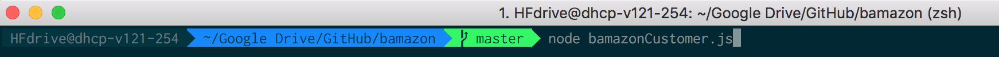
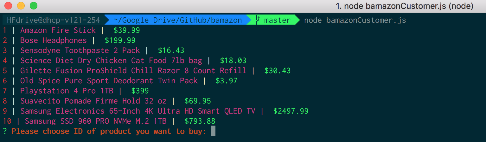
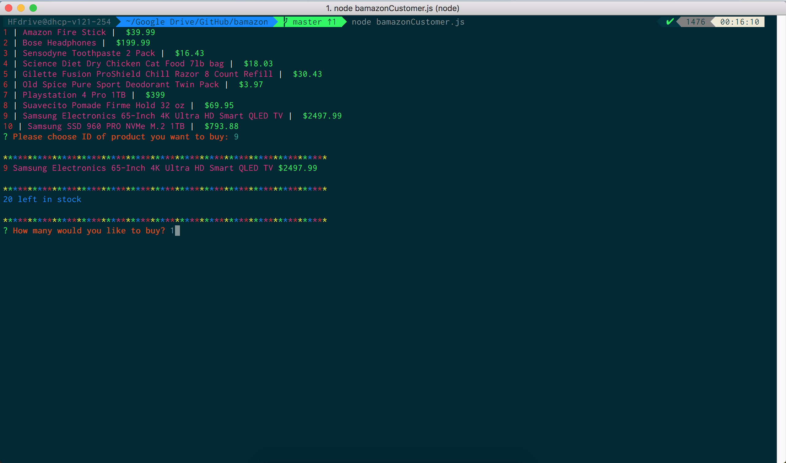
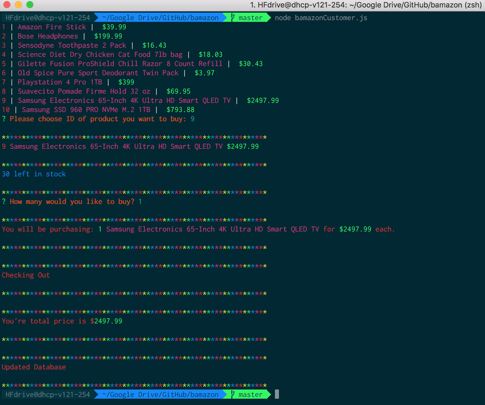
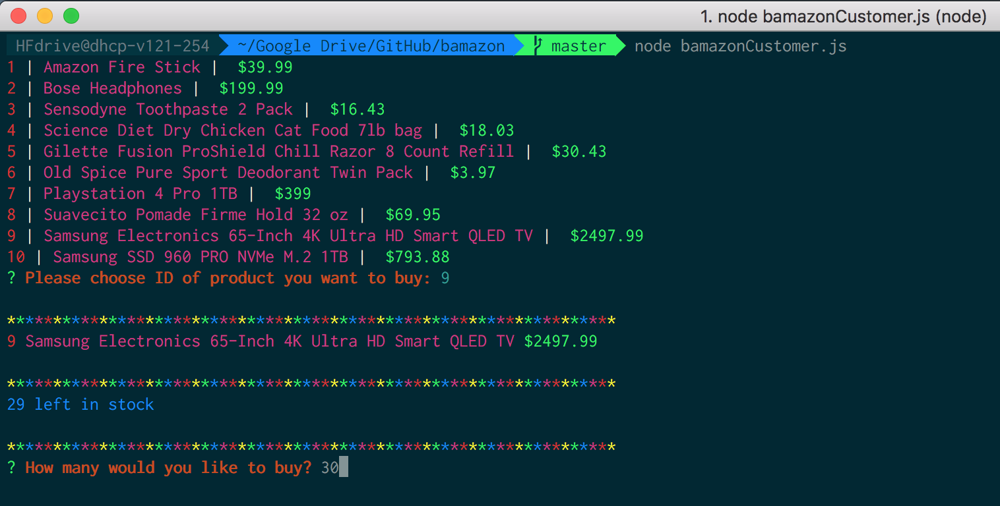
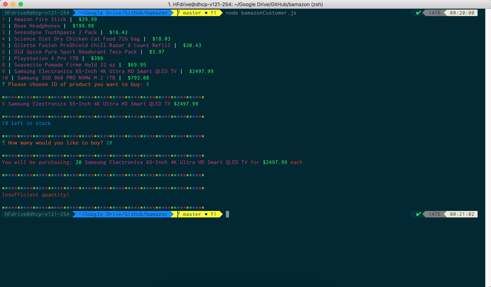

#Bamazon

### Synopsis
***

An interactive shopping node app where MySQL and Node.JS are used to allow users to purchase items as a customer.

##### Bamazon Customer Portal
***

The Bamazon Customer Portal allows users to view the current items available for purchase.  The user will be prompted to enter the item id# and how many items they wish to purchase.  If the item is in stock, the order will be completed and the user will see the total amount of their purchase.

***
The Bamazon Customer portal will also output an "Insufficient Quantity!" if the user inputs an amount greater than the current stock quantity.

#### Technologies Used:
***

* Javascript
* nodeJS
* MySQL
* NPM Packages:
	- [mysql](github.com/mysqljs/mysql)
	- [inquirer](github.com/SBoudrias/Inquirer.js)
	- [colors](github.com/Marak/colors.js)

