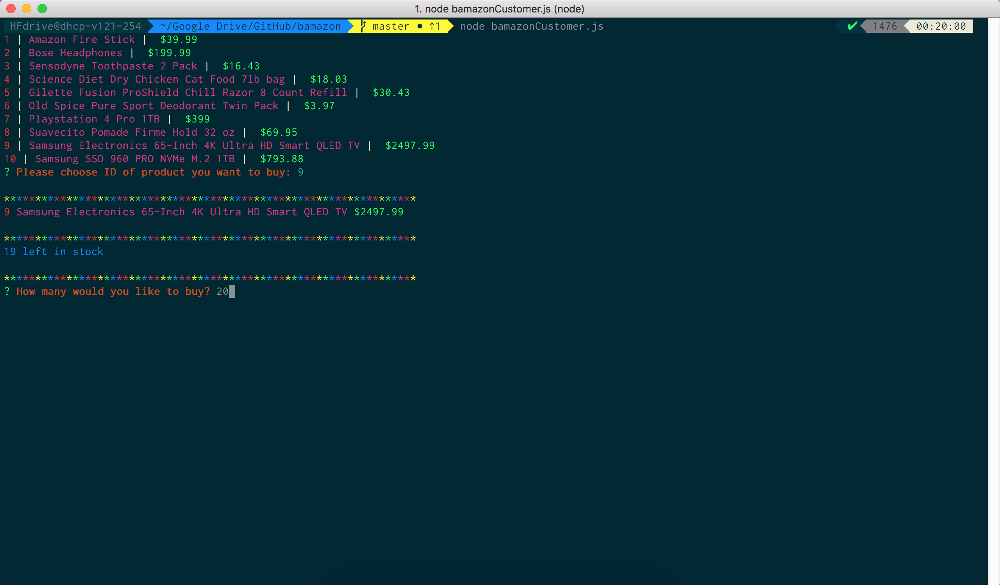

<h1>#Bamazon</h1>

<h2>### Synopsis</h2>
***

<h3>An interactive shopping node app where MySQL and Node.JS are used to allow users to purchase items as a customer.</h3>

<h2>##### Bamazon Customer Portal</h2>
***

<h3>The Bamazon Customer Portal allows users to view the current items available for purchase.  The user will be prompted to enter the item id# and how many items they wish to purchase.  If the item is in stock, the order will be completed and the user will see the total amount of their purchase.</h3>

***

***
<h3>The Bamazon Customer portal will also output an "Insufficient Quantity!" if the user inputs an amount greater than the current stock quantity.</h3>

***

***
#### Technologies Used:
* Javascript
* nodeJS
* MySQL
* NPM Packages:
	- [MySql](github.com/mysqljs/mysql)
	- [Inquirer](github.com/SBoudrias/Inquirer.js)
	- [Colors](github.com/Marak/colors.js)

